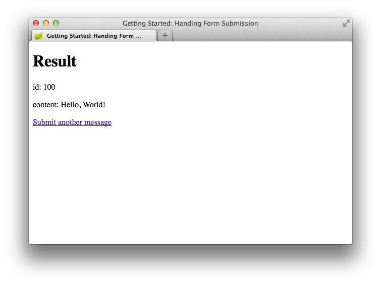

<#assign project_id="gs-handling-form-submission">
This guide walks you through the process of using Spring to create and submit a web form.

What you'll build
-----------------

In this guide, you will build a web form which will be accessible at the following URL:

    http://localhost:8080/greeting

Viewing this page in a browser will display the form. You can submit a greeting by populating the `id` and `content` form fields. A results page will be displayed when the form is submitted.

What you'll need
----------------

 - About 15 minutes
 - <@prereq_editor_jdk_buildtools/>

## <@how_to_complete_this_guide jump_ahead='Create a web controller'/>

Set up the project
------------------

<@build_system_intro/>

<@create_directory_structure_hello/>

### Create a Maven POM

    <@snippet path="pom.xml" prefix="initial"/>

<@bootstrap_starter_pom_disclaimer/>

Create a web controller
-----------------------

In Spring's approach to building web sites, HTTP requests are handled by a controller. These components are easily identified by the [`@Controller`] annotation. The GreetingController below handles GET requests for /greeting by returning the name of a [`View`], in this case, "greeting". A `View` is responsible for rendering the HTML content:

    <@snippet path="src/main/java/hello/GreetingController.java" prefix="complete"/>

This controller is concise and simple, but a lot is going on. Let's analyze it step by step.

The `@RequestMapping` annotation allows you to map HTTP requests to specific controller methods. The two methods in this controller are both mapped to `/greeting`. By default `@RequestMapping` maps all HTTP operations, such as `GET`, `POST`, and so forth. But in this case the `greetingForm()` method is specifically mapped to `GET` using `@RequestMapping(method=GET)`, while `greetingSubmit()` is mapped to `POST` with `@RequestMapping(method=POST)`. This mapping allows the controller to differentiate the requests to the  `/greeting` endpoint.

The `greetingForm()` method uses a [`Model`] object to expose a new `Greeting` to the view template. The `Greeting` object in the following code contains fields such as `id` and `content` that correspond to the form fields in the `greeting` view, and will be used to capture the information from the form.

    <@snippet path="src/main/java/hello/Greeting.java" prefix="complete"/>

The implementation of the method body relies on a [view technology][u-view-templates], in this case [Thymeleaf](http://www.thymeleaf.org/doc/html/Thymeleaf-Spring3.html), to perform server-side rendering of the HTML. Thymeleaf parses the `greeting.html` template below and evaluates the various template expressions to render the form.

    <@snippet path="src/main/resources/templates/greeting.html" prefix="complete"/>

The <#noparse>`th:action="@{/greeting}"`</#noparse> expression directs the form to POST to the `/greeting` endpoint, while the <#noparse>`th:object="${greeting}"`</#noparse> expression declares the model object to use for collecting the form data. The two form fields, expressed with <#noparse>`th:field="*{id}"`</#noparse> and <#noparse>`th:field="*{content}"`</#noparse>, correspond to the fields in the `Greeting` object above.

That covers the controller, model, and view for presenting the form. Now let's review the process of submitting the form. As noted above, the form submits to the `/greeting` endpoint using a `POST`. The `greetingSubmit()` method receives the `Greeting` object that was populated by the form. It then adds that populated object to the model so the submitted data can be rendered in the `result` view, seen below. The `id` is rendered in the <#noparse>`
`</#noparse> expression. Likewise the `content` is rendered in the <#noparse>`
`</#noparse> expression.

    <@snippet path="src/main/resources/templates/result.html" prefix="complete"/>

For clarity, this example utilizes two separate view templates for rendering the form and displaying the submitted data; however, you can also use a single view for both purposes.

Make the application executable
-------------------------------

Although it is possible to package this service as a traditional [WAR][u-war] file for deployment to an external application server, the simpler approach demonstrated below creates a standalone application. You package everything in a single, executable JAR file, driven by a good old Java `main()` method. Along the way, you use Spring's support for embedding the [Tomcat][u-tomcat] servlet container as the HTTP runtime, instead of deploying to an external instance.

### Create an Application class

    <@snippet path="src/main/java/hello/Application.java" prefix="complete"/>

The `main()` method defers to the [`SpringApplication`][] helper class, providing `Application.class` as an argument to its `run()` method. This tells Spring to read the annotation metadata from `Application` and to manage it as a component in the [Spring application context][u-application-context].

The [`@ComponentScan`][] annotation tells Spring to search recursively through the `hello` package and its children for classes marked directly or indirectly with Spring's [`@Component`][] annotation. This directive ensures that Spring finds and registers the `GreetingController`, because it is marked with [`@Controller`][], which in turn is a kind of [`@Component`][] annotation.

The [`@EnableAutoConfiguration`][] annotation switches on reasonable default behaviors based on the content of your classpath. For example, because the application depends on the embeddable version of Tomcat (tomcat-embed-core.jar), a Tomcat server is set up and configured with reasonable defaults on your behalf. And because the application also depends on Spring MVC (spring-webmvc.jar), a Spring MVC [`DispatcherServlet`][] is configured and registered for you — no `web.xml` necessary! Auto-configuration is a powerful, flexible mechanism. See the [API documentation][`@EnableAutoConfiguration`] for further details.

<@build_an_executable_jar_subhead/>

<@build_an_executable_jar/>

<@run_the_application_with_maven module="service"/>

Logging output is displayed. The service should be up and running within a few seconds.

Test the service
----------------

Now that the web site is running, visit <http://localhost:8080/greeting>, where you see the following form:

Submit an id and message to see the results:

Summary
-------

Congratulations! You have just used Spring to create and submit a form.

<@u_war/>
<@u_tomcat/>
<@u_application_context/>
<@u_view_templates/>
[`View`]: http://static.springsource.org/spring/docs/current/javadoc-api/org/springframework/web/servlet/View.html
[`Model`]: http://static.springsource.org/spring/docs/current/javadoc-api/org/springframework/ui/Model.html
[`@Configuration`]:http://static.springsource.org/spring/docs/current/javadoc-api/org/springframework/context/annotation/Configuration.html
[`@ComponentScan`]: http://static.springsource.org/spring/docs/current/javadoc-api/org/springframework/context/annotation/ComponentScan.html
[`@Component`]: http://static.springsource.org/spring/docs/current/javadoc-api/org/springframework/stereotype/Component.html
[`@Controller`]: http://static.springsource.org/spring/docs/current/javadoc-api/org/springframework/stereotype/Controller.html
[`SpringApplication`]: http://static.springsource.org/spring-bootstrap/docs/0.5.0.BUILD-SNAPSHOT/javadoc-api/org/springframework/bootstrap/SpringApplication.html
[`DispatcherServlet`]: http://static.springsource.org/spring/docs/current/javadoc-api/org/springframework/web/servlet/DispatcherServlet.html
[`@EnableAutoConfiguration`]: http://static.springsource.org/spring-bootstrap/docs/0.5.0.BUILD-SNAPSHOT/javadoc-api/org/springframework/bootstrap/context/annotation/SpringApplication.html
